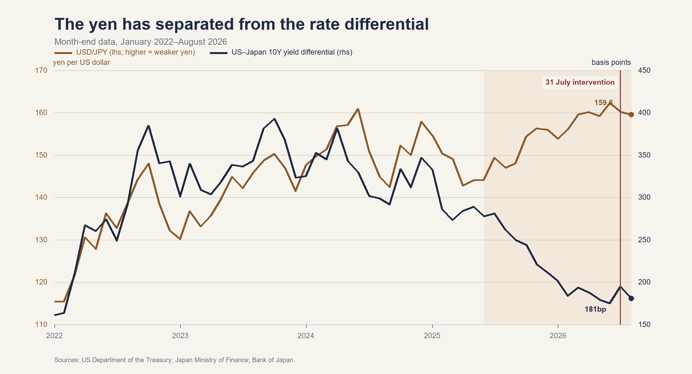
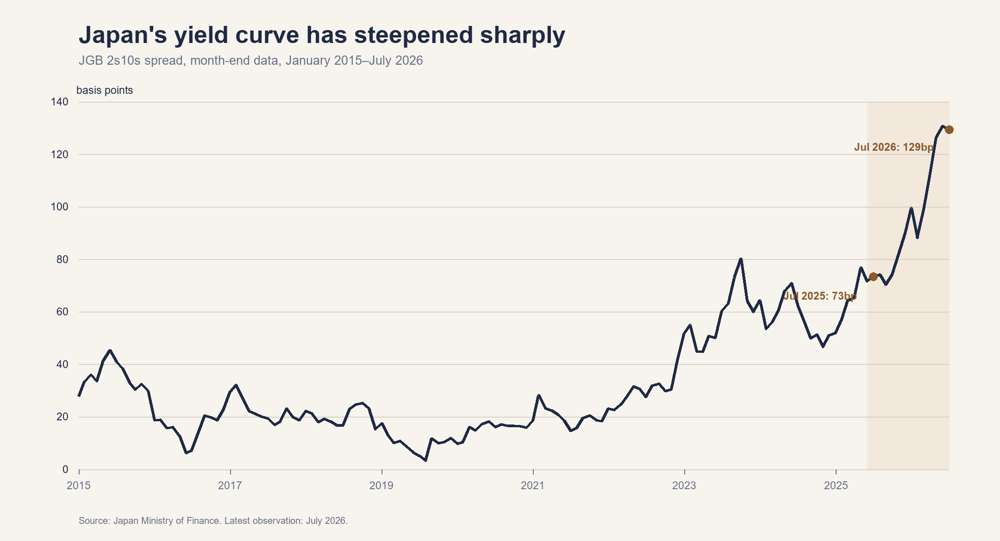

# America's Yen Rescue Is Treating the Symptom Not the Cause

For much of the past few years, the prevailing market explanation for yen weakness was straightforward: the unusually wide short-term interest-rate differential between the United States and Japan made the yen an inexpensive funding currency for investment in higher-yielding dollar assets—the basis of the yen-funded carry trade. Because the yen often failed to appreciate sufficiently to offset this interest advantage—a familiar failure of uncovered interest-rate parity—the carry trade remained profitable and encouraged continued short positions in the currency.

Although carry-trade funding costs are determined primarily at the short end of the yield curve, the broader relative-rate relationship was also visible at longer maturities. USD/JPY generally moved with the yield differential between ten-year US Treasuries and Japanese government bonds (JGBs), which incorporates expectations for the future path of monetary policy as well as longer-term inflation and term premia.

As Figure 1 shows, however, this empirical relationship has become considerably less reliable. Since the middle of 2025, the US–Japan ten-year yield differential has narrowed by more than 100 basis points while the yen has continued to depreciate. Under the conventional interest-rate explanation, the decline in the relative return on US assets should have supported the yen. IMF analysis similarly indicates that the currency's recent depreciation cannot be fully explained by the narrowing yield differential.

The divergence does not necessarily mean that interest rates have ceased to matter. It raises a different question: what does an increase in Japanese yields now represent? A rise driven by expectations of Bank of Japan tightening should ordinarily support the yen; one driven by inflation, additional bond supply or fiscal risk need not do so. In the latter case, investors are being compensated not only for holding longer-duration bonds, but also for risks increasingly associated with the Japanese policy framework.

*Figure 1. The US–Japan ten-year yield differential narrowed markedly after the middle of 2025, while USD/JPY continued to rise. A higher USD/JPY denotes a weaker yen. Sources: US Department of the Treasury, Japan Ministry of Finance and Bank of Japan.*

## From the carry trade to the Takaichi trade

Prime Minister Sanae Takaichi has associated her administration with higher public expenditure and proposed tax reductions. Although monetary policy is determined independently by the Bank of Japan, the administration’s preference for continued accommodation has reinforced market expectations that policy normalisation will proceed only gradually.

The Takaichi trade emerged as the market expression of this policy outlook. It is commonly described as a combination of three positions: long Japanese equities, short Japanese government bonds and short the yen. Stronger nominal growth and corporate earnings were expected to support equities; additional bond issuance and higher inflation were expected to place pressure on JGBs; and a slower-than-otherwise normalisation of monetary policy was expected to weigh on the yen.

In its initial form, the trade therefore represented a conventional reflation thesis rather than a crisis of confidence. The interpretation becomes less benign when higher Japanese yields provide little support for the yen, particularly when the increase is concentrated at the long end of the curve. Between July 2025 and July 2026, the 2s10s JGB spread widened from approximately 70 to 129 basis points; by the end of the period, the ten-year and two-year yields stood at about 2.79% and 1.50%, respectively. Yet USD/JPY reached an intramonth high of almost 164: higher long-term Japanese yields had been accompanied by further currency depreciation rather than appreciation.

*Figure 2. The JGB 2s10s spread widened from approximately 73 basis points in July 2025 to 129 basis points in July 2026, leaving it close to a two-decade high. Source: Japan Ministry of Finance.*

Neither the steepening of the curve nor the depreciation of the yen provides a standalone measure of fiscal risk. Taken together, however, they are consistent with an increase in the term premium partly associated with fiscal concerns, although they do not isolate its contribution.

The resulting pattern invites comparison with the United Kingdom under Liz Truss. In 2022, the announcement of fiscal expansion without a sufficiently credible explanation of its financing prompted a simultaneous sell-off in sterling and gilts and forced a rapid reversal of policy.

Nevertheless, describing the episode as a Japanese Truss moment would be an overstatement. Japan borrows in its own currency, maintains a large domestic investor base and possesses substantial foreign assets. The Bank of Japan also has much greater practical influence over the domestic government-bond market than the Bank of England had over gilts during the Truss episode. This makes an immediate funding crisis considerably less likely.

The similarity lies not in an equivalent probability of default, but in the simultaneous repricing of the currency and government bonds as concerns about fiscal sustainability increase. In Japan, the exceptionally large stock of public debt makes the interaction between fiscal and monetary policy particularly important: faster monetary tightening would gradually raise the government's interest burden, while insufficient tightening could allow inflationary pressure and yen weakness to persist.

Put more simply, Japan faces an increasingly difficult trade-off between protecting the purchasing power of the yen and containing the government's financing costs.

## Can fiscal risk be measured

There is no single market price for fiscal risk, and yen weakness alone is not evidence that fiscal sustainability has deteriorated. Higher long-term yields are relevant only if they cannot be explained by stronger growth, inflation, expected Bank of Japan tightening or a general repricing of global bond markets. A fiscal interpretation becomes more plausible when the remaining increase in yields coincides with fiscal announcements, greater expected bond issuance and renewed yen weakness.

The 2s10s spread—the difference between ten-year and two-year government-bond yields—is a commonly used measure of the yield-curve slope. Because the two-year yield is relatively sensitive to the expected path of monetary policy, a widening spread indicates that upward pressure is concentrated further along the curve. It does not, however, identify the source of that pressure. Stronger long-term growth, higher inflation expectations, additional bond supply and a rise in the term premium can all produce a steeper curve without implying a deterioration in fiscal sustainability.

Monitoring this risk therefore requires a small dashboard rather than reliance on one spread:

- 2s10s JGB spread: the standard measure of the curve between near-term policy expectations and longer-term risk.
- 10s30s or 10s40s JGB spread: potentially more revealing for fiscal concerns, since Japan's debt-supply and duration risk are concentrated further along the curve.
- Japanese break-even inflation: useful for determining whether the rise in nominal yields reflects greater inflation compensation, rather than for identifying fiscal risk by itself.
- USD/JPY relative to the US–Japan yield differential: useful for identifying currency movements that a simple relative-rate model cannot explain, but not for determining whether the omitted cause is fiscal risk, investor positioning or another macro-financial factor.
- Cross-currency basis and sovereign CDS: useful secondary checks for funding stress and perceptions of sovereign credit risk, although neither provides a clean measure of fiscal sustainability.

No individual indicator establishes that fiscal risk is driving the yen. A fiscal interpretation would become more persuasive if a disproportionate increase in long-term yields and unexplained yen depreciation were accompanied by systematic market responses to fiscal announcements and changes in expected government-bond issuance. The important observation is therefore not simply that Japanese yields are rising, but that long-dated yields are rising without delivering the currency appreciation that higher domestic yields would normally generate.

## Why did the United States intervene

On 31 July, Japan purchased yen in coordination with the US Treasury. This was the first coordinated US–Japan intervention to strengthen the yen since 1998. Japan stated that the operation was undertaken to counter excessive volatility and disorderly currency movements, and indicated that further joint intervention remained possible. It also announced an intention to make future use of the Federal Reserve's FIMA Repo Facility.

The direct objective was straightforward: both authorities bought yen in order to increase demand for the currency and interrupt the one-way speculative trade against it.

The American rationale extended beyond Japan's rising import bill. Japan can finance intervention by drawing down dollar deposits or selling dollar assets. If intervention were repeated on a sufficiently large scale, outright sales of US Treasuries could add pressure to a market already absorbing substantial government issuance. Future use of the Federal Reserve's FIMA Repo Facility would allow Japan to obtain dollars temporarily against its Treasury holdings rather than sell them outright. US participation therefore helped contain the risk that instability in the yen would spill over into its own government-bond market.

There is also a regional consideration. A rapidly depreciating yen places pressure on other Asian economies to tolerate weaker currencies in order to maintain export competitiveness. What begins as a Japanese adjustment could therefore develop into a wider sequence of competitive depreciation and financial instability.

US participation served an additional signalling function. Joint action increased the cost of maintaining a one-way position against the yen and indicated that the exchange rate had become a shared policy concern. Historically, coordinated interventions have tended to be more effective than isolated operations.

## How did the intervention work

Japan sold foreign-currency assets, principally dollars, and used the proceeds to purchase yen. The US Treasury, acting through the Federal Reserve Bank of New York, reportedly took the unusual step of selling euros from its reserves and purchasing yen. The use of euros allowed the United States to support the yen without directly selling dollars (EU be like bruh). The New York Fed normally conducts such transactions for the Treasury's Exchange Stabilization Fund in its capacity as fiscal agent.

The initial market reaction was substantial: USD/JPY declined from around 163 to approximately 155, representing an appreciation of about 5% in the yen. Japan ultimately reported cumulative foreign-exchange intervention of approximately JPY15.4 trillion between 30 July and 26 August.

## Did it last

Only partly.

By the end of August, USD/JPY had returned to around 160, reversing more than half of the yen's initial appreciation. The currency subsequently strengthened again to around 156 in early September. With no additional intervention confirmed, this later movement appears to have reflected a reassessment of the likelihood of further Bank of Japan rate increases.

The intervention temporarily halted an accelerating sell-off and indicated that the 163–164 area would not be treated with indifference. It did not establish a durable reversal in the currency.

That distinction matters. Intervention can remove speculative positions, create uncertainty for short sellers and buy time for policymakers. It cannot permanently offset a policy configuration that continues to place downward pressure on the yen.

## Conclusion

The limited persistence of the intervention does not necessarily mean that it failed. If the purpose was to break disorderly momentum, reduce immediate financial-stability risk and communicate a policy boundary, the operation achieved part of its objective.

Nevertheless, the return of USD/JPY towards 160 indicates that official purchases did not remove the underlying source of the pressure. A durable appreciation would require clearer limits on fiscal expansion, a credible approach to debt management and monetary policy consistent with price stability. More importantly, these changes would restore confidence that movements in Japanese yields reflect a policy framework consistent with price stability rather than compensation for mounting fiscal risk.

The US operation should therefore be interpreted as the purchase of time rather than the purchase of a permanently stronger yen. Its lasting value depends on what Japan does with that time. If the policy mix changes, the intervention may eventually be regarded as the moment at which the one-way trade was broken. If it does not, repeated intervention will instead expose the difference between an official balance sheet's capacity to move an exchange rate temporarily and a policy framework's capacity to sustain its value.

## Sources

- [International Monetary Fund, Japan 2026 Article IV Consultation](https://www.imf.org/-/media/files/publications/cr/2026/english/1jpnea2026001.pdf)
- [Japanese Ministry of Finance, Statement by Finance Minister Satsuki Katayama, 3 August 2026](https://www.mof.go.jp/english/public_relations/statement/others/20260803073000.html)
- [Bank of Japan, Economic Activity Prices and Monetary Policy in Japan, 26 February 2026](https://www.boj.or.jp/en/about/press/koen_2026/ko260226a.htm)
- [Japan Bond Trading, JGB Market Overview, July 2025](https://www.bb.jbts.co.jp/ja/marketinfo/report/main/0110/teaserItems1/00/linkList/012/link/market_202507.pdf)
- [Japan Bond Trading, JGB Rates Historical Data](https://www.bb.jbts.co.jp/en/historical/main_rate.htm)
- [Bank of Japan, Foreign Exchange Rates](https://www.stat-search.boj.or.jp/ssi/mtshtml/fm08_m_1_en.html)
- [US Department of the Treasury, Daily Treasury Par Yield Curve Rates](https://home.treasury.gov/resource-center/data-chart-center/interest-rates/TextView?type=daily_treasury_yield_curve)
- [Federal Reserve Bank of New York, Foreign Exchange Operations](https://www.newyorkfed.org/markets/international-market-operations/foreign-exchange-operations)
- [Japanese Ministry of Finance, Foreign Exchange Intervention Operations, 30 July–26 August 2026](https://www.mof.go.jp/policy/international_policy/reference/feio/data/monthly/20260828.html)
- [MUFG Research, JPY Monthly September 2026](https://www.mufgresearch.com/fx/jpy-monthly-september-2026/)
